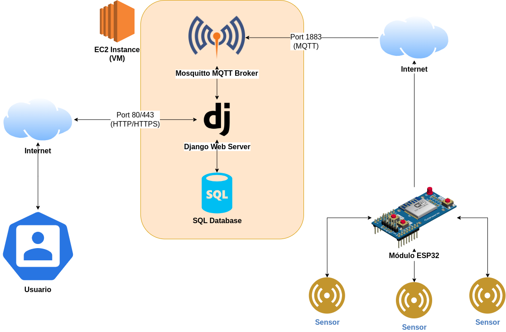

# 🌐 Proyecto Final: Servidor IoT con Django y MQTT 🛠️

¡Bienvenido! Este es un proyecto desarrollado como parte de la materia **Temas Selectos de Programación I** en la **Facultad de Ingeniería, UNAM**. Su propósito es permitir a los usuarios monitorear y controlar dispositivos IoT desde cualquier lugar con acceso a internet, aprovechando tecnologías modernas como **Django**, **MQTT** y **AWS**.

---

## 📋 Detalles Técnicos

- **Materia:** Temas Selectos de Programación I
- **Profesor:** Ing. Emiliano Nava Morales
- **Alumno:** Jorge Eithan Treviño Selles
- **Fecha:** 11 de diciembre de 2024

### 🛠️ Herramientas Utilizadas

- **Backend:** Python, Django
- **Frontend:** HTML, CSS, JavaScript, jQuery
- **Bases de datos:** SQLite (por defecto en Django)
- **Hardware:** ESP32
- **Protocolo de comunicación:** MQTT con Mosquitto Broker
- **Infraestructura:** AWS EC2
- **Sistema operativo:** Linux

---

## 🚀 Funcionalidades

1. Monitoreo remoto de dispositivos IoT.
2. Configuración de intervalos de medición de sensores.
3. Gestión de dispositivos desde una interfaz web amigable.
4. Comunicación eficiente con el protocolo MQTT.

---

## 📂 Estructura del Proyecto

```yaml
iot_project/ # Proyecto Final: Servidor IoT con Django y MQTT
├── docs/ # Documentación del proyecto
├── esp32/ # Código para el ESP32
│ ├── floater.ino # Código para sensor de flotador
│ ├── dh11.ino # Código para sensor DHT11
├── iot_app/ # Aplicación de Django
│ ├── management/ # Scripts de administración de Django
| ├ ├── commands/ # Comandos personalizados de Django
| |  ├ ├── mqtt_subscriber.py # Script para suscribirse a un tópico MQTT
│ ├── migrations/ # Migraciones de la base de datos
│ ├── static/ # Archivos estáticos de la aplicación
│ │ ├── iot_app/ # Archivos de la aplicación de Django
│ │ │ ├── styles.css # Estilos CSS de la aplicación
│ ├── templates/ # Plantillas HTML de la aplicación
├── iot_project/ # Proyecto de Django
│ ├── asgi.py # Archivo de configuración de ASGI
│ ├── settings.py # Archivo de configuración de Django
│ ├── urls.py # Archivo de rutas de Django
│ ├── wsgi.py # Archivo de configuración de WSGI
├── scripts/ # Scripts de Linux
│ ├── subscriber.service # Servicio de Linux para el script subscriber.py
│ ├── subscriber.sh # Script para ejecutar subscriber.py
├── static/ # Archivos estáticos de la aplicación
├ ├── admin/ # Archivos del panel de administración de Django
├ ├── iot_app/ # Archivos de la aplicación de Django
├── .gitignore # Archivo de configuración de Git
├── db.sqlite3 # Base de datos SQLite
├── manage.py # Script de administración de Django
├── README.md # Archivo de documentación
└── requirements.txt # Archivo de dependencias de Python
```


---

## 📋 Requerimientos

### Requisitos de Software

- Python 3.11+
- Django 4.2+
- Instancia de AWS EC2
- Mosquitto MQTT Broker (instalado en AWS EC2)
- SQLite (instalado por defecto en Python)
- Arduino IDE (para programar el ESP32)
- Bibliotecas de Python: paho-mqtt, django, django-crispy-forms
- Bibliotecas de Arduino: WiFi, PubSubClient
- Navegador web (Chrome, Firefox, Safari)

### Instalación de Dependencias

1. Clona este repositorio:
```bash
   git clone https://github.com/e1th4nUwU/iot_project.git
   cd iot_project
```
2. Crea un entorno virtual:
```bash
   python -m venv venv
   source venv/bin/activate
```

3.  Instala las dependencias:
    
```bash
pip install -r requirements.txt
```
4. Crea una instancia de AWS EC2, asegurándote de abrir los puertos necesarios (1883, 80, 443, 22). Debes configurar y anotar la dirección IP pública de tu instancia.

5.  Configura el broker MQTT (Puerto 1883) y el servidor web en AWS EC2.

6. Configura el archivo `settings.py` de Django con la dirección IP de tu broker MQTT y la dirección IP de tu servidor web.

7. Arma el circuito con el ESP32 y el sensor de tu elección.

8. Programa el ESP32 con el código necesario para conectarse a tu red WiFi y al broker MQTT, usa los archivos `.ino` proporcionados en la carpeta `esp32`. Recuerda cambiar los valores de SSID, contraseña y dirección IP del broker MQTT.

9. Monta los servicios de Django y Mosquitto en tu servidor web. Usa el archivo `subscriber_service.sh` para configurar un servicio de Linux que ejecute el script `subscriber.py` en segundo plano dentro de la máquina virtual.

10. Corre el servicio de Django en tu servidor web y accede a la dirección IP pública de tu instancia de AWS EC2 para ver la interfaz web.

11. ¡Listo! Ahora puedes monitorear y controlar tus dispositivos IoT desde cualquier lugar con acceso a internet.


### 🌟 Diagrama de conexión
------------


---

🤝 Contribuciones
-----------------

¡Las contribuciones son bienvenidas! Abre un issue o envía un pull request para discutir mejoras o soluciones.

* * *

📧 Contacto
-----------

Cualquier duda o comentario, puedes contactarme en **eithantrevino@gmail.com**.

¡Gracias por visitar este repositorio! 😊


> Para más información, lee el informe completo del proyecto en el archivo `docs/ConnectionDiagram.drawio.pdf`.